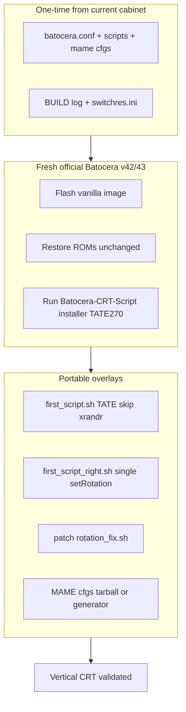

# Design — Vanilla Batocera Vertical CRT (Portable Bundle)

## Why not Myzar

| Topic | Myzar/Mizar stance | This project |
|-------|-------------------|--------------|
| **DisplayPort** | Not supported; not part of their CRT philosophy | Hardware uses **DP** to reach the CRT (via DAC/scaler as needed) |
| **DP + DAC** | Not allowed / not discussed as a valid path | Required workaround for real wiring — handled on **vanilla Batocera + CRT Script**, not by arguing inside Myzar |
| **Vertical gameplay** | Pre-built image + configs | Same outcome via **CRT Script TATE** + captured/portable userdata |
| **Dependency** | Myzar image, community rules | **ZFEbHVUE/Batocera-CRT-Script** + official Batocera only |

**Bottom line:** We are not migrating because vanilla is “better at rotation” — we are migrating because **Myzar refuses the display interface this build uses**, and we still want vertical CRT with the same ROMs.

## Architecture

## Key design decisions

1. **CRT Script is the primary vertical engine** — `display.rotate`, `mame.rotation`, generated `first_script.sh`, Switchres, patched `batocera-resolution`. Same path Myzar uses; Myzar image is pre-baked convenience.
2. **Portable overlays are Myzar-session fixes** — ES horizontal-after-quit, duplicate `setRotation` removal. Required on top of stock CRT `first_script.sh-generic-v42` for this cabinet behavior.
3. **MAME 1066× rotate=270** is a **policy choice**, not ROM magic. Optional on vanilla if `mame.rotation=autorol` is enough.
4. **Display path is user-owned** — CRT installer + `batocera-boot.conf` for the real output (DP, HDMI, VGA, etc.). No reliance on Myzar to endorse DP; no requirement to hide DP usage inside their image.

## Exact implementation files

Full path table: **[file-manifest.md](file-manifest.md)**

Portable copies (deploy as-is): **`portable/`**

Installer menu record: **[crt-installer-choices.md](crt-installer-choices.md)**

Capture script: **[scripts/capture-vertical-bundle.sh](scripts/capture-vertical-bundle.sh)**

## Differences: Myzar image vs vanilla + CRT + portable

| Layer | Myzar | This design |
|-------|-------|-------------|
| OS image | Custom/preconfigured | Official Batocera 42/43 |
| CRT installer | Already run or embedded | You run v42/v43 script once |
| `first_script_right.sh` | Shipped/custom | `design/portable/first_script_right.sh` |
| ES exit fix | Patched in session | `apply-es-exit-rotation.sh` |
| MAME cfgs | 1066× on device | Capture tarball or regenerate |
| Boot DP/interlace | `myzar-dp` | Omitted |
| ROMs | Same | Same — no repack |
