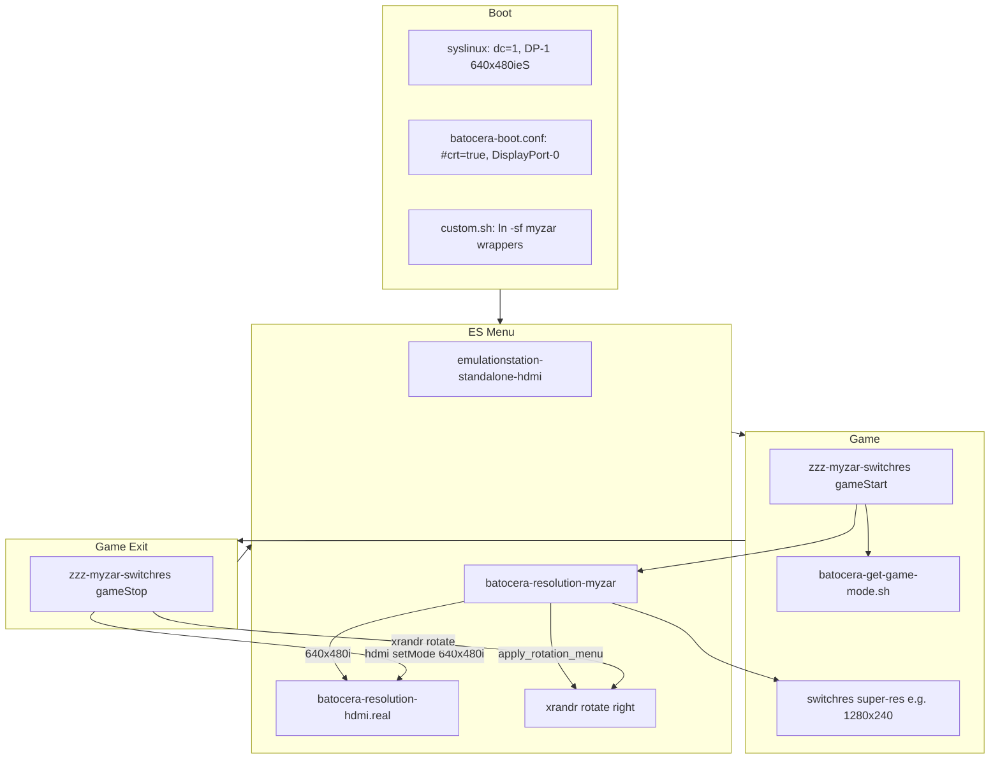

# Design — Myzar DisplayPort Hybrid Switchres

## Architecture

## Naming map

| Layer | Identifier |
|-------|------------|
| DRM / kernel | `DP-1`, `card0-DP-1` |
| X11 / Switchres | `DisplayPort-0` |

`batocera-resolution-hdmi` is not HDMI-specific — it follows `global.videooutput`.

## Three resolution layers

1. **Menu** — always `640x480i.60.00` + cabinet rotate (`display.rotate=1` → 480×640)
2. **`videomodes.conf`** — CRT catalog (~56 modes) for ES Advanced → Video Mode
3. **Per-game Switchres** — `batocera-get-game-mode.sh` + `mame.switchres=1` at launch

Super-res examples (X modeline, landscape during play):

| Game | Timing | Typical X mode |
|------|--------|----------------|
| ddpdoj / Cave 384×224 | 384x224.59.19 | 1536×224 |
| 320×240 vertical | 320x240.60.00 | 1280×240 |
| pacman | 288x224.60.61 | ~1152×224 class |

`super_width=1024` in switchres.ini / MAME ini aligns horizontal stretch.

## What not to use

- **Full CRT path:** `crt=true` + `emulationstation-standalone-crt` + `display.rotate=1` → broken ES (e.g. 224×2048)
- **Bulk `rotate="270"` cfgs** — fights Switchres (pillarbox)
- **Duplicate exit scripts** — `first_script_right` + `zzz-myzar` + `rotation_fix` → slow exit

## Persistence

- `/userdata` survives reboot
- `/usr/bin` symlinks may reset → `custom.sh` must re-link **before any `exit`**
