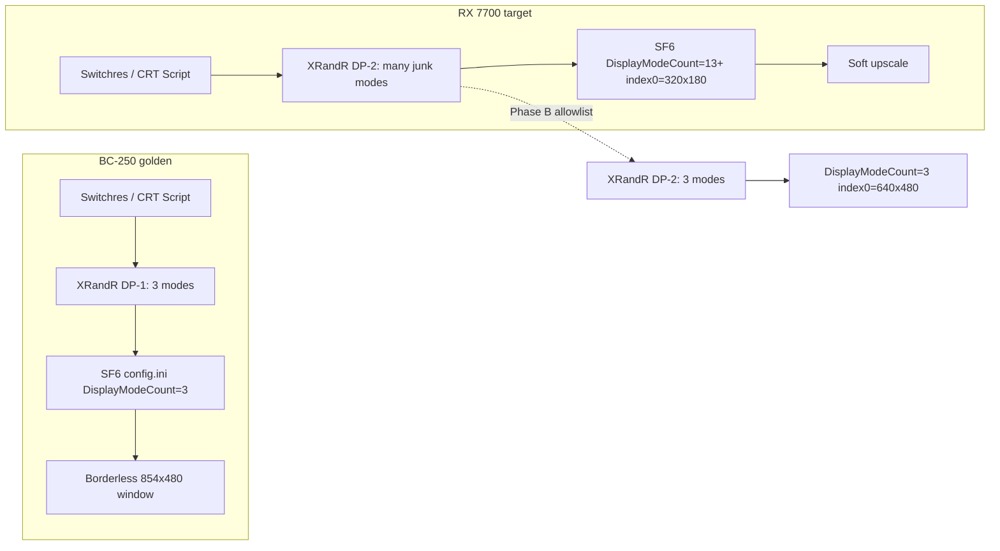

# Design — CRT SF6 / ms929 Display Mode Parity

## Architecture (what must match)



## Fix flow (agent checklist)

1. **Read-only audit** on 7700 (same script as BC-250).
2. **Mode allowlist on CRT connector** until `xrandr` ≤ 3 modes.
3. **Relaunch SF6**; confirm `config.ini` regenerates with `DisplayModeCount=3`.
4. **Set/keep** golden `config.ini` keys (Borderless, TAA, IQ=1, etc.).
5. **Optional:** Flatpak Steam + Proton Experimental to match launch path.
6. **Fix stale** `global.videooutput=DP-2` if still `DP-5`.
7. **Never** loop-kill ES / force ES to 854 as an SF6 fix.

## Mode allowlist target

Keep only:

| Mode name (example) | Role |
|---------------------|------|
| `641x480i` | EDID preferred / Boot_480i |
| `641x480` | Progressive sibling |
| `SR-1_854x480@60.00i` or Switchres `854x480.60.00068` | Steam / SF6 desktop |

## Why sed-on-index fails

```
Launch → SF6 enumerates X modes → rewrites DisplayMode* → may set FullScreenDisplayMode=0
Exit   → SF6 writes config.ini again
```

If mode 0 is 320×180, every “fix the index” is temporary. Shorten the list so **0 is safe**.
