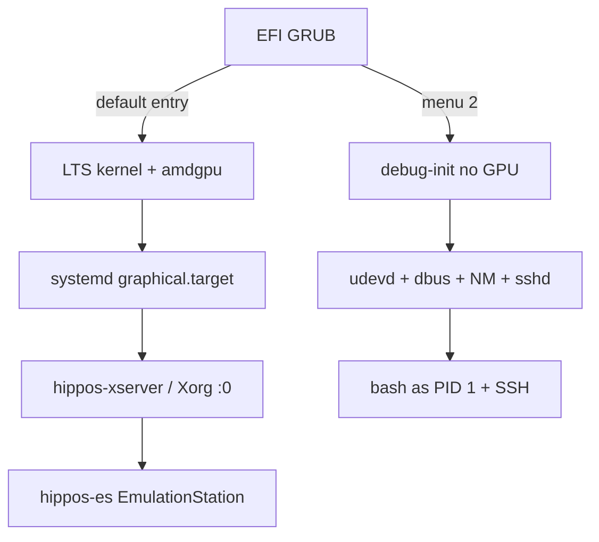

# Design — HippOS BC-250 boot bring-up

## Documents

| File | Purpose |
|------|---------|
| [proposed-flash-boot-flow.md](proposed-flash-boot-flow.md) | **Upstream ask:** fresh-flash UX with latest default + LTS picker |
| This README | What we ran on the live disk (proof path) |

---

## Live proof architecture (current disk)

## Key components (live)

| Piece | Role |
|-------|------|
| EFI `grub.cfg` | Chooses LTS graphical vs debug-init |
| `hippos-debug-init` | Minimal userspace without systemd |
| fstab `nofail` + 5s timeouts | Avoid 30s+ device waits |
| Masks | Skip wait-online / remote-fs / nvidia stubs / grub rewriters |
| `hippos-xserver` + `hippos-es` | Visible UI |

## Recovery path

If graphical boot regresses: pick GRUB **DEBUG init**, SSH `root`/`linux`, inspect `journalctl -b`, or remount from Batocera and restore a `grub.cfg.bak-*`.

## Proposed product flow

See [proposed-flash-boot-flow.md](proposed-flash-boot-flow.md): visible GRUB, **latest default**, **LTS selectable** (remembered), first-boot `update-grub` preserves that menu, systemd hardened so BC-250 reaches ES without hand edits.
